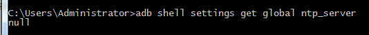
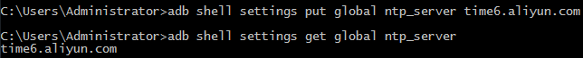

昨天更新了最新的AEX6.0 20181129-0837版本, 发现时间一直是错的. 网络同步时间和网络同步时区都是打开的, 而且时区也是正确的.

最奇怪的是只要一重启时间就会变成23:42.

从play上下载了clocksync也不能同步时间.
<!--more-->

后来经一个群友提醒发现可以使用adb设置ntp服务器, 于是抱着试一试的态度搜索了一下.
找到了一个命令
```shell
adb shell settings put global ntp_server <new-ntp-server>
```
既然有put那么应该对应的还有一个get, 于是运行了一下
```shell
adb shell settings get global ntp_server
```
果然返回了null, 这就是说明ntp server是空的, 所以不能同步网络时间



然后搜索到阿里云的ntp服务器地址
```
time1.aliyun.com
time2.aliyun.com
time3.aliyun.com
time4.aliyun.com
time5.aliyun.com
time6.aliyun.com
time7.aliyun.com
```
随便挑选其中一个
```shell
adb shell settings put global ntp_server time6.aliyun.com
```
执行成功不会有任何提示, 可以再次执行上边的get命令看一下



可以看到返回了刚才设置的地址, 说明设置成功了. 重启一下手机, 时间能够正常同步了.
